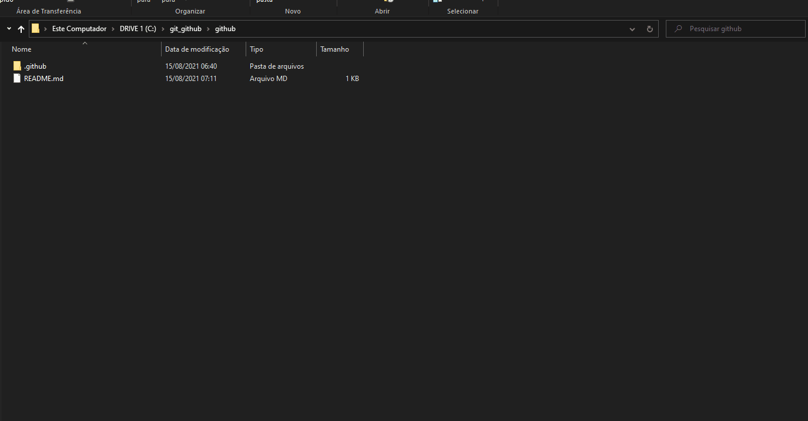

<h1 align="center">
  
</h1>

<h3 align="justify">
Academic demonstration of uploading updated files from the development environment via Git via GitBash to the GitHub repository. Credits for you tube channel module Tiago A. Silva.
</h3>

 

## 📷 Demonstration

  

 

## 🚀 Technologies

This project was developed with the following technologies:

- Git
- GitBash
- GitHub

 

## ⚙ Settings
- git Bash Here
- git status
- git add .
- git commit -a -m "mensage"
- git push origin master
 

---

Made with 💜 by Rafael Maciel
